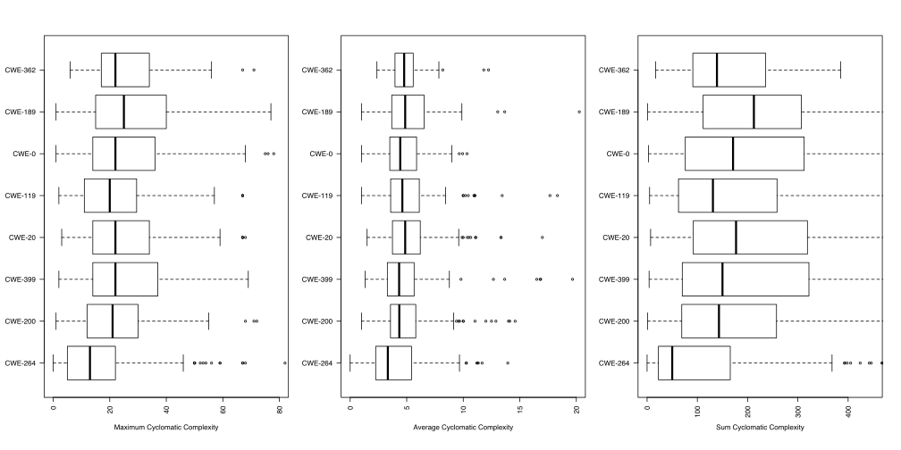
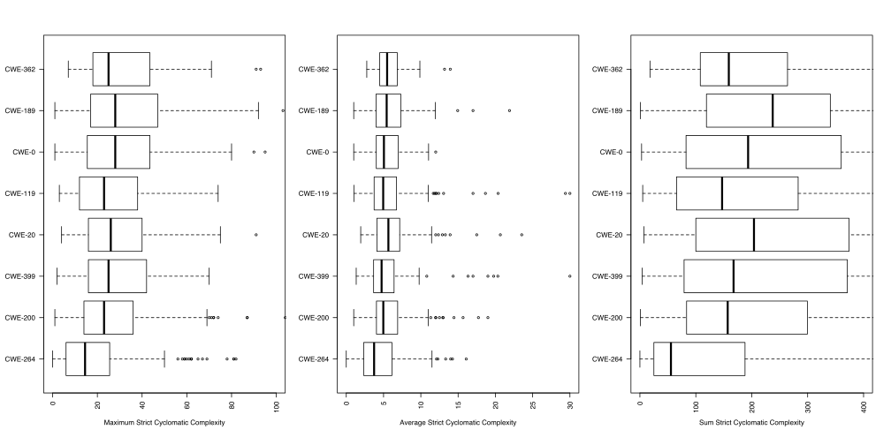
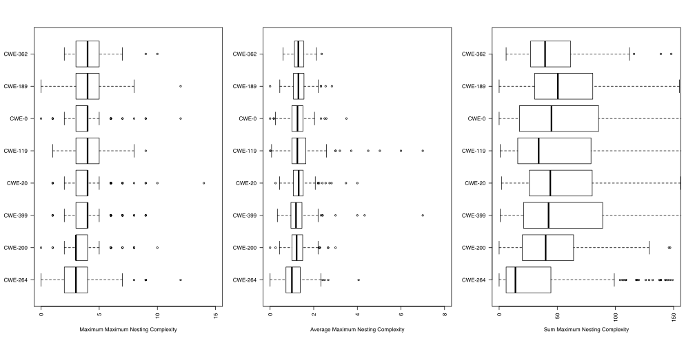
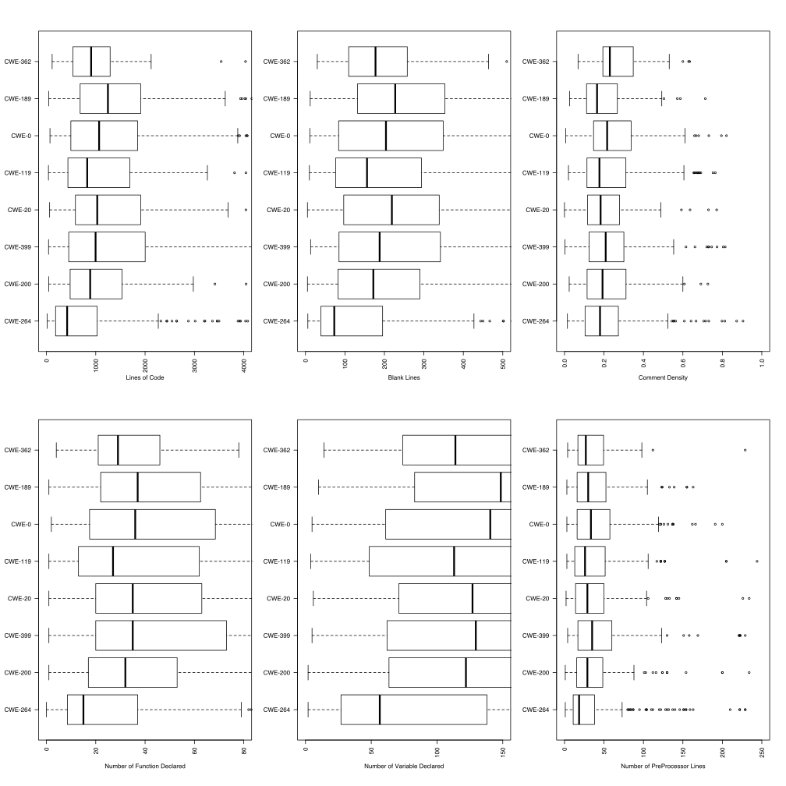
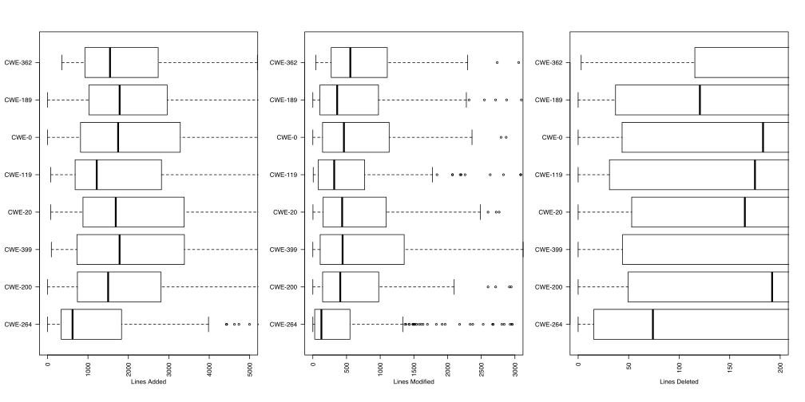

## Complexity of Vulnerable Files

### Cyclomatic Complexity

### Modified Cyclomatic Complexity

### Strict Cyclomatic Complexity

### Essential Complexity

### Fan In

### Fan Out

### Maximum Nesting

## Code Metrics

## Developer History

## Line History

