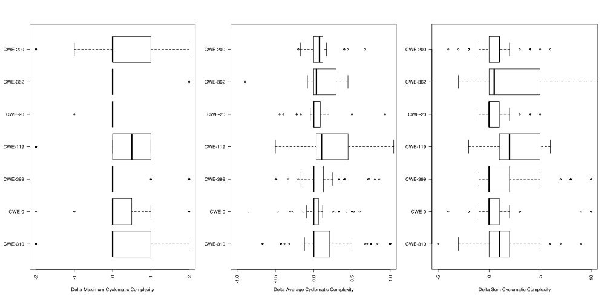
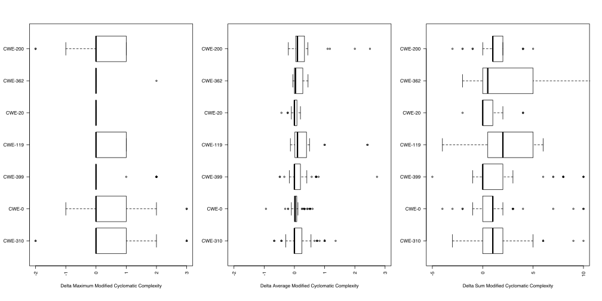
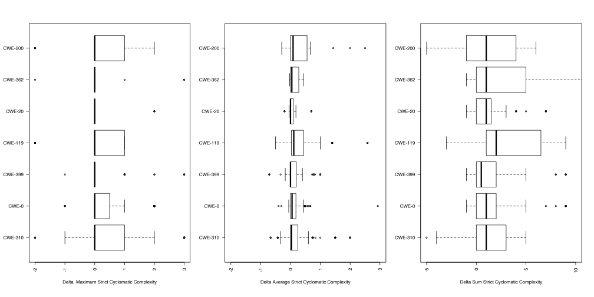
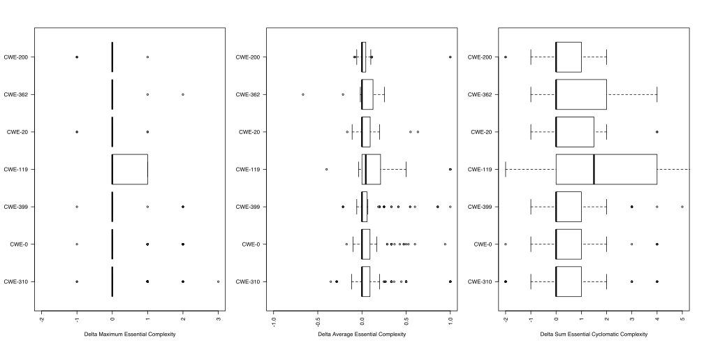
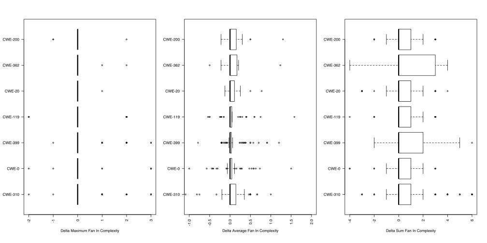
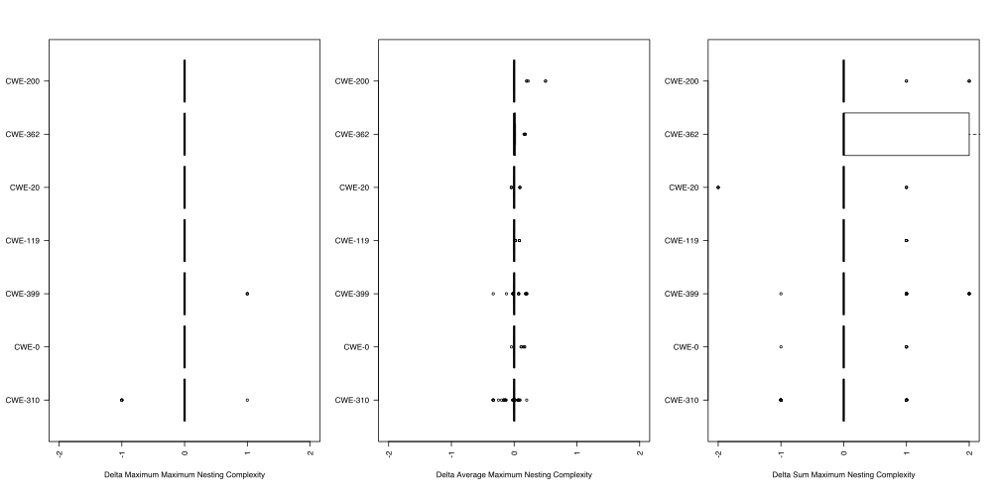
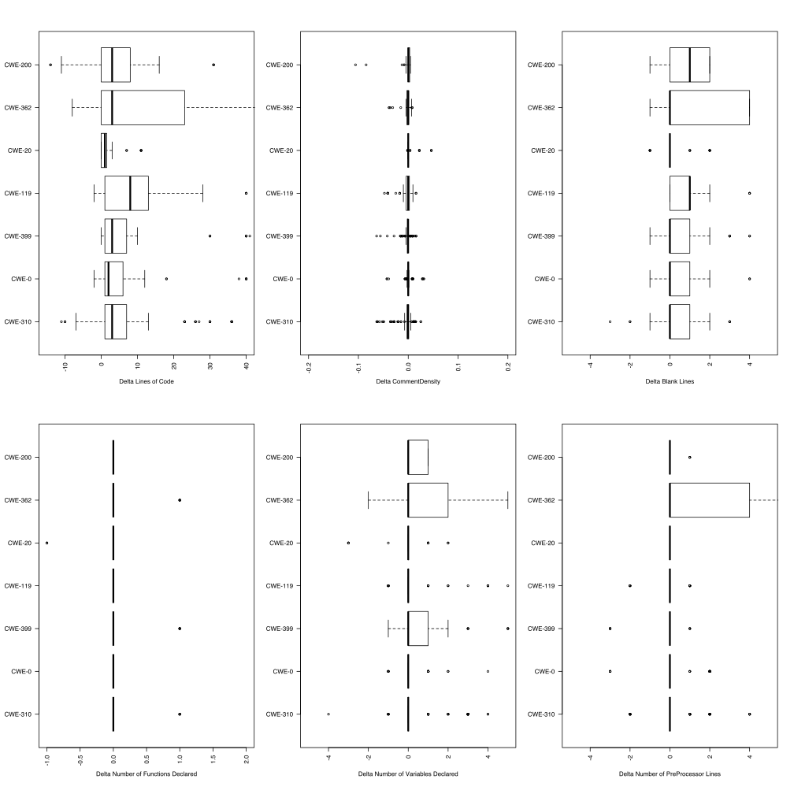
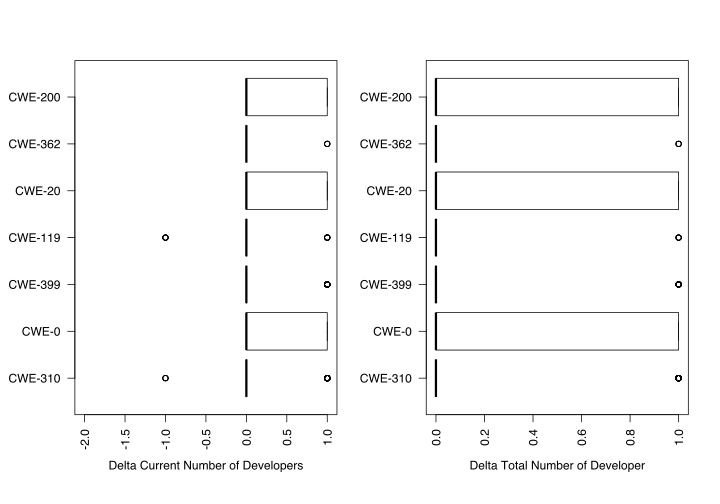
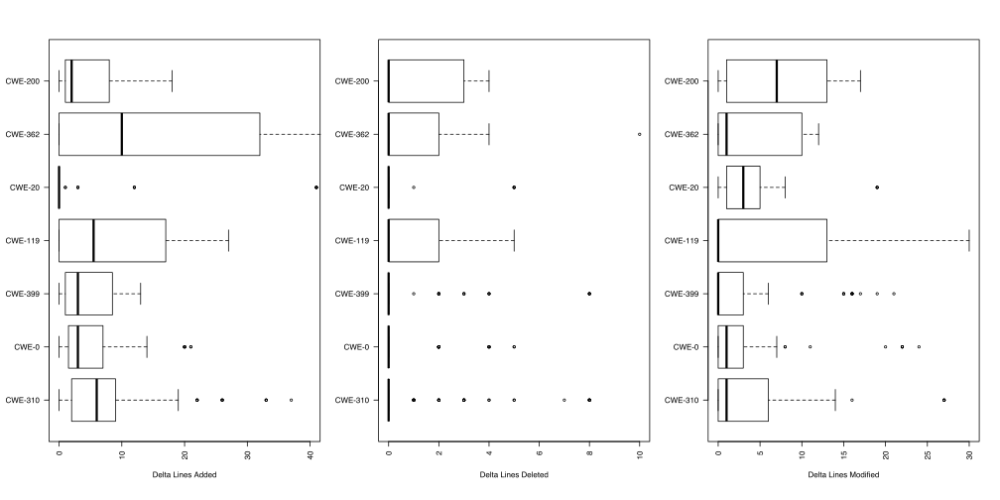

## Delta Complexity of Vulnerable Files

### Delta Cyclomatic Complexity

### Delta Modified Cyclomatic Complexity

### Delta Strict Cyclomatic Complexity

### Delta Essential Complexity

### Delta Fan In

### Delta Fan Out

### Delta Maximum Nesting

## Delta Code Metrics

## Delta Developer History

## Delta Line History

